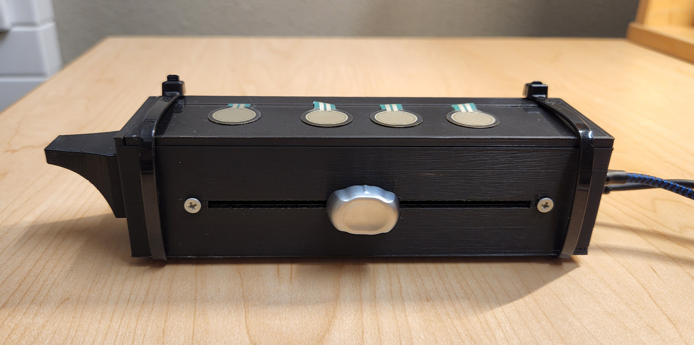
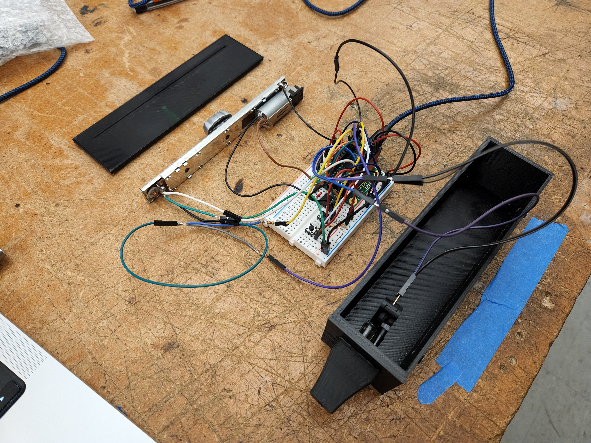
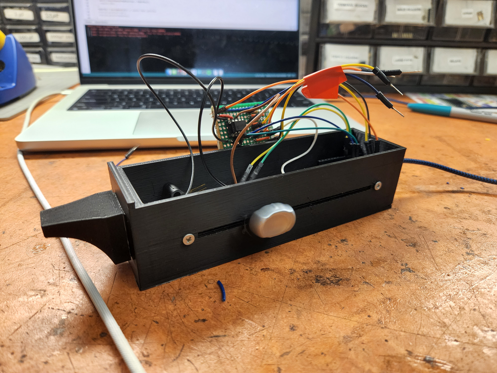

# Slide Whistlinator

[YouTube Demo ](https://www.youtube.com/watch?v=sxiH_CKzvS0)

The Slide Whistlinator is a 3D printed, motorized, embedded DSP musical instrument combining the 
whimsical charm of a toy slide whistle with automatic sliding precision. Integrating a motorized 
mixing board fader (slider) and 4 FSRs (Force Sensing Resistors) binary encoded to slide position 
control, this instrument enables one to expressively "slide" in pitch continuously and discreetly 
(note by note). With responsive breath sensing and dynamic, on-board "whistle" synthesis featuring 
harmonic overblow, the Slide Whistlinator enables digital musical expressivity and melodic control 
for the most serious of slide whistlers or those who just wanna have fun! 

[Fusion 360 Model](https://stanford2145.autodesk360.com/g/shares/SH512d4QTec90decfa6e2cfc4cd1c14c0619)

## Parts:
- Teensy 4.0 + Audio Shield
- Alps Motorized Fader 
- MPX5010 Pressure Sensor
- 4 FSRs

## Images

